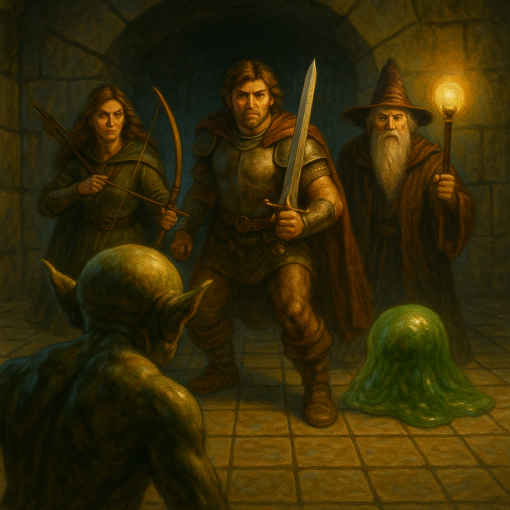

# Dungeon Crawltographer

Dungeon Crawltographer is a simple, fast, and lightweight tool for creating grid-based maps for tabletop role-playing games. Built with Python and Pygame, it provides an intuitive interface for game masters to quickly sketch out dungeon layouts, mark points of interest, and manage multi-level environments.



## Features

- **Grid-Based Mapping**: Easily draw and erase cells on a grid.
- **Icon System**: Place a variety of pre-defined icons to mark entrances, traps, treasure, and more.
- **Multi-Floor Support**: Create complex, multi-level dungeons and switch between floors.
- **Save & Load**: Save your maps to `.json` files and load them later.
- **Undo/Redo**: Don't worry about mistakes with multi-level undo and redo support.
- **View Controls**: Pan, zoom, and rotate the map to get the perfect view.
- **Cell Labeling**: Add short text labels to any cell.
- **Multi-Select**: Select and modify multiple cells at once.
- **Cell Locking**: Protect cells from accidental edits.
- **Player Mode**: A special mode to track player party movement and automatically reveal the map.
- **Fullscreen Mode**: Immerse yourself in the mapping experience.

## Requirements

- Python 3.x
- Pygame library

*(Optional)*
- `tkinter` is used for native OS file dialogs. If not installed, the application provides a basic fallback.

## How to Run

1.  **Install Pygame**:
    If you don't have Pygame installed, open your terminal or command prompt and run:
    ```sh
    pip install pygame
    ```

2.  **Run the Application**:
    Navigate to the project directory and run the main script:
    ```sh
    python dungeon_mapper.py
    ```

## Controls & Hotkeys

### General
| Key | Action |
| :--- | :--- |
| `Ctrl` + `S` | Save the current map. |
| `Ctrl` + `L` | Load a map from a file. |
| `Ctrl` + `Z` | Undo the last action. |
| `Ctrl` + `Y` | Redo the last undone action. |
| `F11` | Toggle fullscreen mode. |
| `ESC` | Close any open dialog or menu. |

### Map Interaction
| Action | Description |
| :--- | :--- |
| **Left Click** | Place the selected icon or select a single cell. |
| **Left Click + Drag** | Continuously draw with the selected icon. |
| **Right Click / Drag** | Erase cells. |
| **Shift + Left Click + Drag** | Draw a box to select multiple cells. |
| **Middle Mouse + Drag** | Pan the map view. |
| **Mouse Wheel** | Zoom the map in or out. |
| `L` | Add or edit a text label on the currently selected cell. |
| `K` | Toggle the "locked" state for all selected cells. |

### Navigation & View
| Key | Action |
| :--- | :--- |
| `W` / `S` | Move the player token forward/backward (in Player Mode). |
| `A` / `D` | Rotate the map view 90 degrees left/right. |
| `Arrow Keys` | Pan the map view. |
| `Page Up` / `Page Down` | Go up or down one floor. |
| `P` | Toggle Player Mode (enables player token and auto-explore). |
| `=` or `+` | Zoom in. |
| `-` | Zoom out. |

### Icon Selection
Use the number keys to quickly select an icon from the panel.

| Key | Icon |
| :--- | :--- |
| `0` | Erase / No Icon |
| `1` | Entrance |
| `2` | Chest |
| `3` | Locked Door |
| `4` | Stairs Up |
| `5` | Stairs Down |
| `6` | Boss |
| `7` | NPC |
| `8` | Switch |
| `9` | Trap |